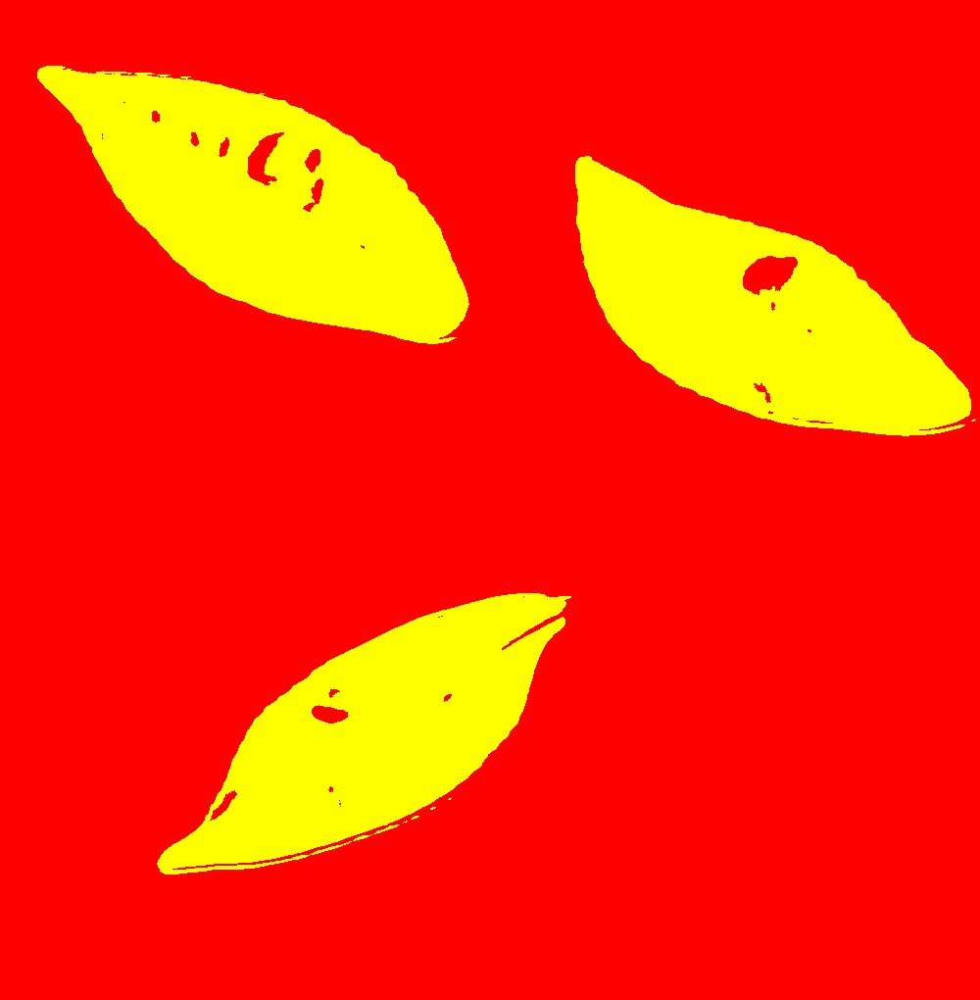
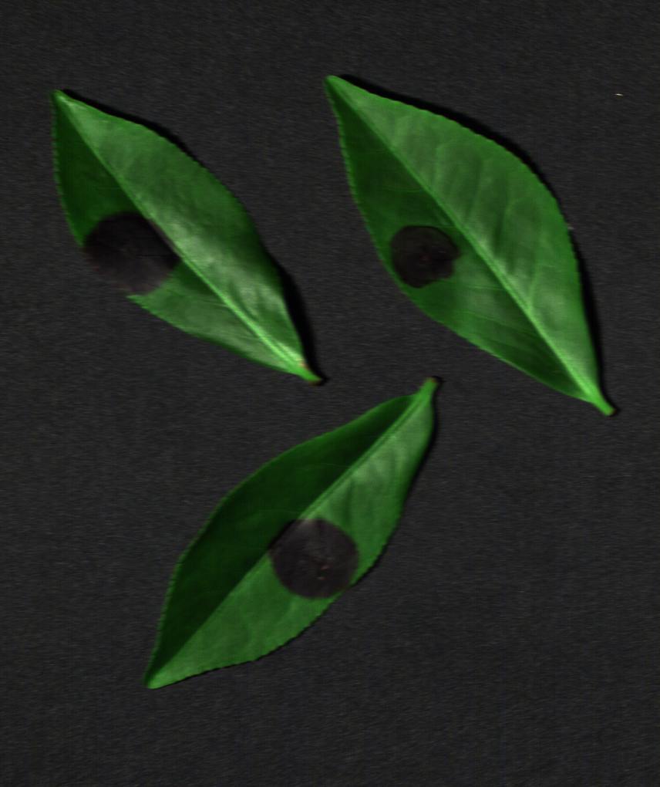
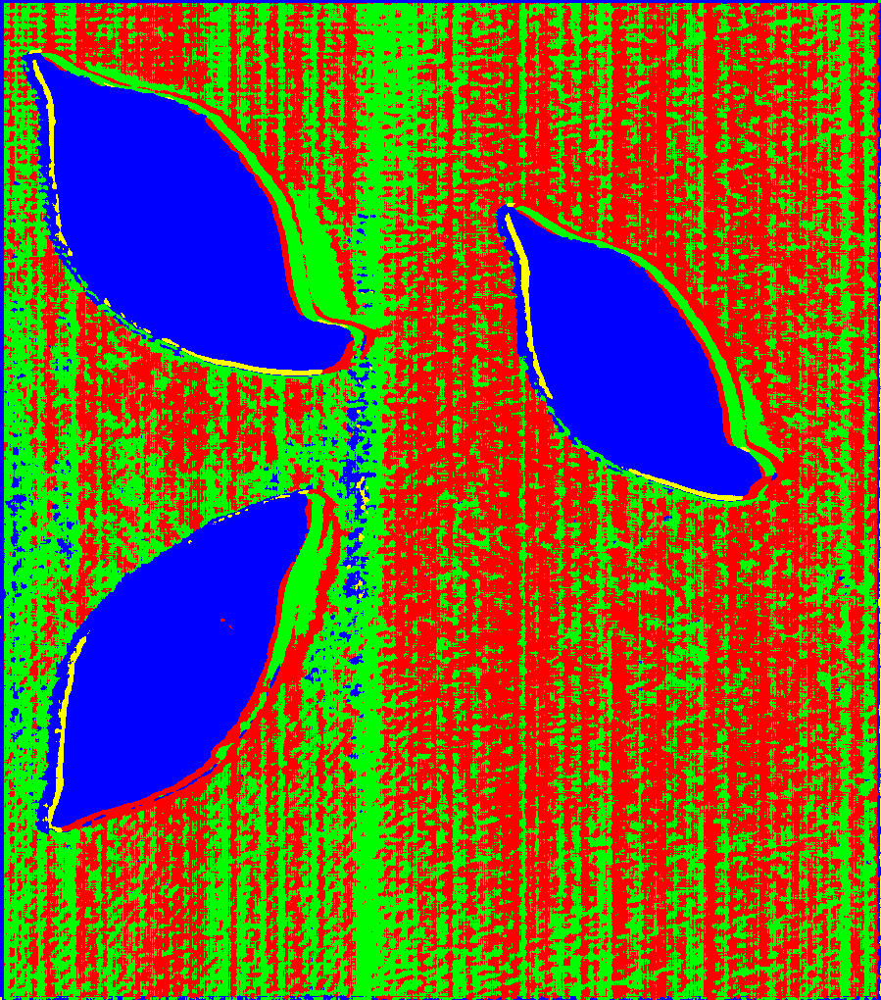
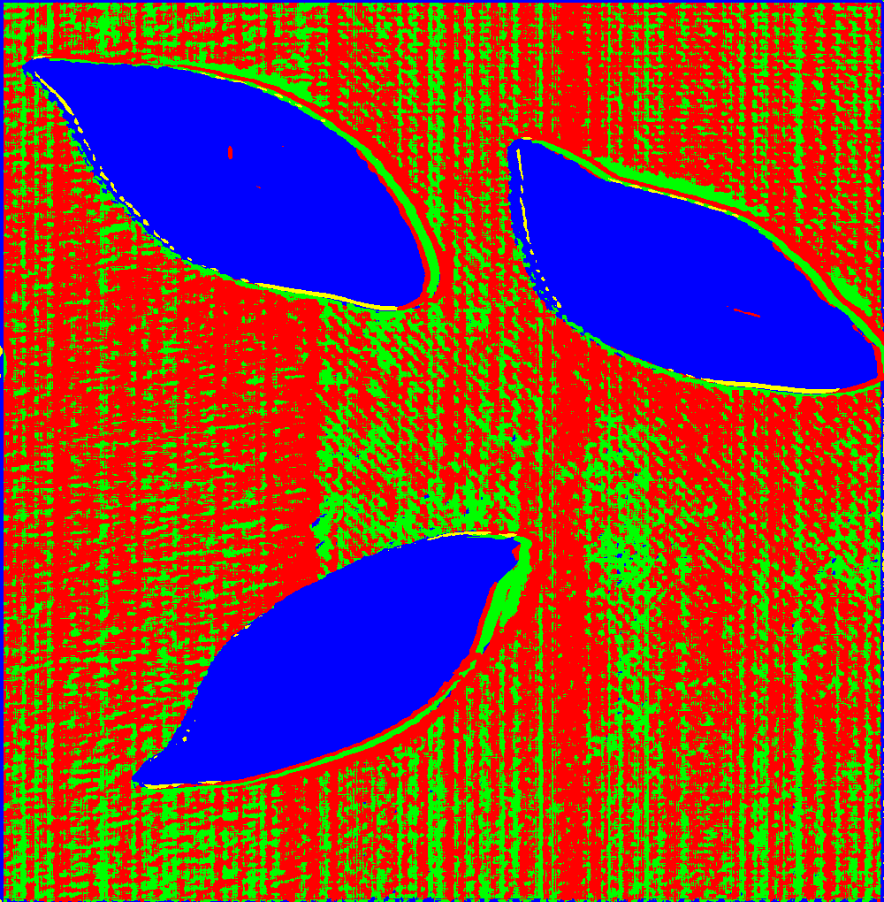
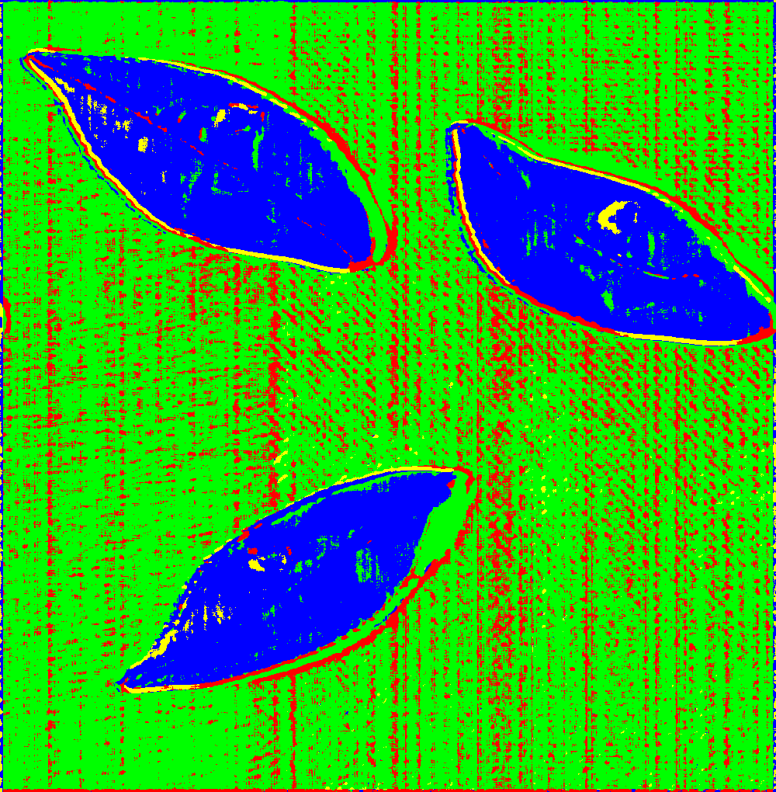
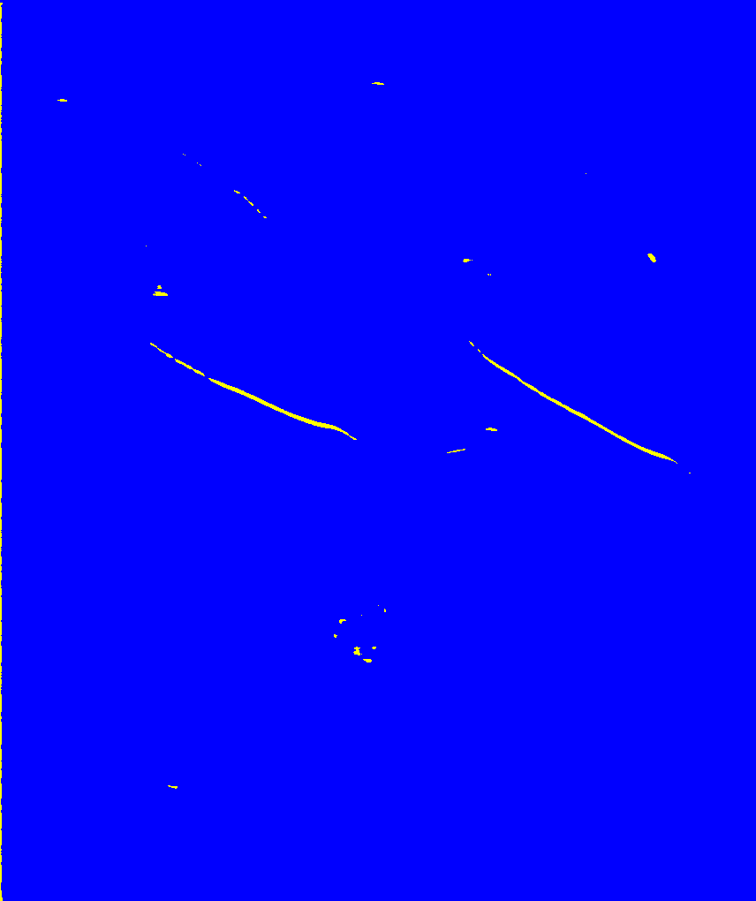
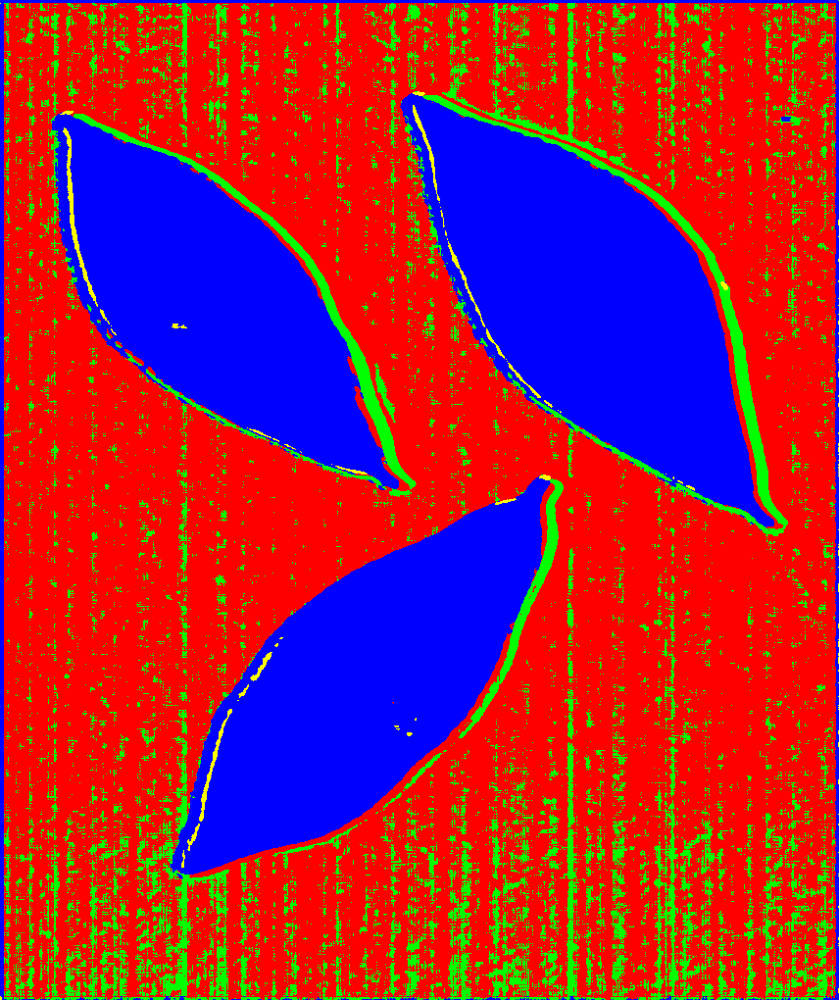
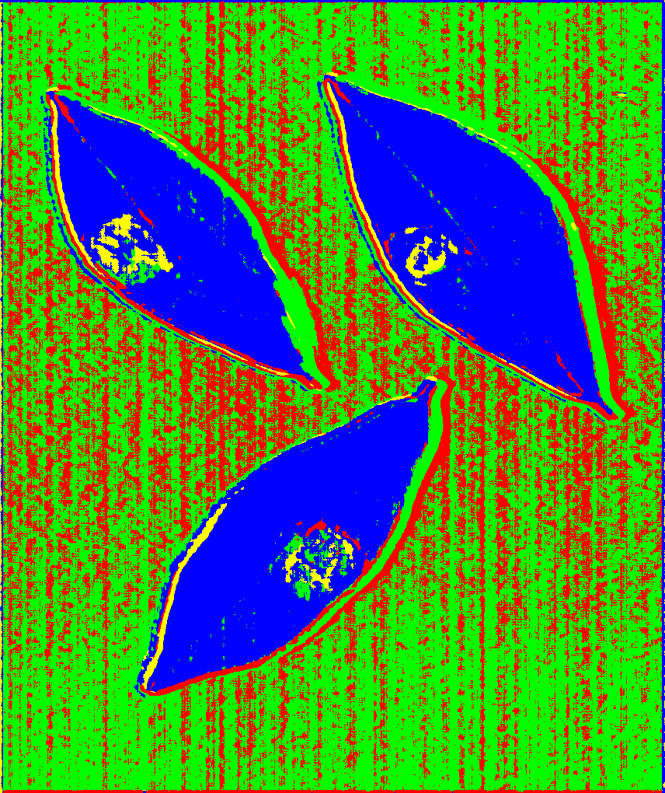

# Deep Global Clustering for Hyperspectral Image Segmentation

[](https://opensource.org/licenses/MIT)
[](https://arxiv.org/abs/2512.24172)

This repository implements **Deep Global Clustering (DGC)**, a conceptual framework for memory-efficient, label-free hyperspectral image (HSI) clustering. DGC learns global cluster structure from local patch observations using differentiable mean-shift and an exponential moving-average (EMA) centroid dictionary.

**Project Status:** This is a research framework demonstrating core concepts (overlapping grids, navigable granularity, sparse activation). The synchronous trainer is functional for reported results; the asynchronous variant exhibits optimization instability and is included for diagnostic purposes.

---

## Overview

### What is DGC?

DGC addresses the challenge of clustering large hyperspectral images (e.g., 1000×1000×301) with limited GPU memory by:

- **Training on small patches** (64×64) while learning **global cluster assignments**
- Achieving **constant memory usage** regardless of full image size
- Operating in an **unsupervised, label-free** manner

### Design Philosophy

**1. Overlapping Grids**
Two random crops from the same HSI cube create overlapping regions. Pixels in the overlap must receive consistent cluster IDs, while non-overlapping pixels learn independently. This enforces global structure through local observations.

**2. Navigable Granularity**
Unlike fixed K-means, DGC starts with more clusters (e.g., K=16) and lets users merge them to desired semantic levels. This "coarse-to-fine" refinement is user-controlled, not hardcoded.

**3. Sparse Activation**
Not all K clusters activate in every scene. Healthy leaves use only background + tissue clusters; infected leaves activate additional lesion clusters. This mimics bottom-up concept learning.

**4. Efficiency Through Patches**
64×64 patches from 1000×1000 cubes provide a 250× memory reduction. Combined with reuse iterations (sample multiple patches per load), DGC trains in **<30 minutes on a consumer GPU** (RTX 4080, 10GB VRAM).

### Results

DGC learns global cluster structure within a few training epochs. The following examples show how segmentation patterns emerge during training.  

The dataset contains tea leaves at different disease stages. Healthy and infected plants were kept in the same chamber to ensure pathogen transmission. Sample 1 shows healthy leaves, Sample 2 shows leaves with medium lesion development (day 3 post-infection), and Sample 3 shows leaves with larger lesion areas (day 5 post-infection). 

#### DGC-2 (Background / Tissue)

| Sample | Pseudo Image | Epoch 4 | Epoch 8 | Epoch 10 |
|--------|--------------|---------|---------|----------|
| 1 (Healthy) |  |  |  |  |
| 2 (Day 3) |  |  |  |  |
| 3 (Day 5) |  |  |  |  |

With two clusters, DGC separates background from tissue. Lesion areas are grouped with either background or tissue depending on their spectral similarity.

#### DGC-4 (Background / Tissue / Lesion)

| Sample | Pseudo Image | Epoch 6 | Epoch 8 | Epoch 10 |
|--------|--------------|---------|---------|----------|
| 1 (Healthy) |  |  |  |  |
| 2 (Day 3) |  |  |  |  |
| 3 (Day 5) |  |  |  |  |

With four clusters, DGC distinguishes background texture, healthy tissue, and lesion regions. The lesion cluster activates only in infected samples—healthy leaves use fewer clusters, demonstrating sparse activation behavior.

Segmentation patterns emerge within 4–6 epochs and become meaningful by evolving to epoch 10.

---

## Key Features

- **Spectral–Spatial Encoder**: 1D spectral CNN + 2D spatial CNN with ℓ²-normalized embeddings
- **Unrolled Mean-Shift Module**: Differentiable clustering with learned bandwidth
- **Global Centroid Dictionary**: EMA updates with automatic low-mass centroid pruning
- **Self-Supervised Losses**: Compactness, orthogonality, balance, and crop-consistency
- **Data Augmentation**: Overlapping two-crop strategy, random affine, wavelength shifts
- **GPU-Accelerated Metrics**: IoU, Dice, RMSE, entropy, NMI, VI (PyTorch implementations)
- **Flexible Trainers**:
  - `HSIClusteringTrainer` — stable synchronous training
  - `AsyncHSIClusteringTrainer` — shared-memory prefetching (experimental, unstable)

---

## Installation

**Requirements:** Python 3.8+, PyTorch 1.12+, CUDA 11.0+ (recommended)

```bash
# Clone repository
git clone https://github.com/b05611038/HSI_global_clustering.git
cd HSI_global_clustering

# Install dependencies
pip install -r requirements.txt
```

**Dependencies:** `torch`, `numpy`, `scipy`, `h5py`, `pillow`, `tensorboard`, `safetensors`

---

## Dataset Preparation

### Data Format

DGC expects HSI cubes stored as MATLAB `.mat` files with a specific structure:

**Required:**
- `.mat` file containing a hyperspectral cube under key `'cube'` (or custom key)
- Cube shape: `(C, H, W)` where C = spectral bands, H/W = spatial dimensions
- Supported formats: Standard `.mat` (scipy) or HDF5-based `.mat` (h5py)

**Optional (for evaluation):**
- **LabelMe JSON annotations** (for semantic labels) OR
- **`.pth` label files** (pre-rasterized PyTorch tensors)

### Example Directory Structure

```
/data/
├── hsi_mat/
│   ├── scene01.mat    # Contains 'cube': (301, 1024, 1024)
│   ├── scene02.mat
│   └── ...
├── hsi_json/          # Optional: LabelMe annotations
│   ├── scene01.json
│   ├── scene02.json
│   └── ...
└── hsi_labels/        # Optional: Pre-rasterized labels
    ├── scene01.pth
    └── ...
```

**Note:** Filenames must match across directories (e.g., `scene01.mat` ↔ `scene01.json`).

---

## Quick Start

### Training (Synchronous)

Use `run_clustering.py` for stable training:

```bash
python run_clustering.py \
  --mat_dir /data/hsi_mat \
  --json_dir /data/hsi_json \
  --out_dir ./outputs \
  --bands 301 \
  --crop_h 64 --crop_w 64 \
  --embed_dim 32 \
  --n_clusters 64 \
  --num_iters 3 \
  --epochs 50 \
  --batch 4 \
  --lr 1e-3 \
  --device cuda
```

**Key Arguments:**
- `--mat_dir`: Directory with `.mat` HSI cubes
- `--json_dir`: Optional annotation directory (omit for unsupervised)
- `--out_dir`: Output path for logs/checkpoints
- `--bands`: Number of spectral channels (e.g., 301 for our dataset)
- `--n_clusters`: Number of cluster centroids (start with 64, merge later)
- `--num_iters`: Mean-shift unrolling steps (3 is typical)

This will:
1. Create `outputs/logs/` (TensorBoard) and `outputs/checkpoints/` (model saves)
2. Train with overlapping two-crop augmentation
3. Save checkpoints every `--save_interval` epochs

### Training (Asynchronous - Experimental)

For async data loading (faster I/O on slow disks, **but optimization is unstable**):

```bash
python run_async_clustering.py \
  --mat_dir /data/hsi_mat \
  --json_dir /data/hsi_json \
  --out_dir ./outputs \
  --bands 301 \
  --epochs 50 \
  --steps_per_epoch 1000 \
  --device cuda
```

**Warning:** Async trainer exhibits "firework" instability (clusters form briefly then collapse). Use only for research/diagnostic purposes. See paper for detailed failure mode analysis.

---

## Evaluation & Inference

### Clustering Evaluation

Run inference and compute metrics (IoU, Dice, RMSE) using `eval_clustering.py`:

```bash
# Automatic Hungarian alignment
python eval_clustering.py \
  --checkpoint_path ./outputs/checkpoints/model_epoch_50.pth \
  --mat_dir /data/hsi_mat \
  --json_dir /data/hsi_json \
  --auto-align \
  --device cuda

# Manual cluster-to-label mapping
python eval_clustering.py \
  --checkpoint_path ./outputs/checkpoints/model_epoch_50.pth \
  --mat_dir /data/hsi_mat \
  --label_dir /data/hsi_labels \
  --manual-mapping '{0:[0,1],1:[2,3,4]}' \
  --device cuda
```

**Manual Mapping Format:** JSON dict mapping semantic labels (keys) to cluster IDs (values). Example: `{0:[0,1], 1:[2,3]}` merges clusters 0,1 → label 0 and clusters 2,3 → label 1.

### Visualization

Generate color-coded cluster maps for all images:

```bash
python layout_predictions.py \
  --checkpoint_path ./outputs/checkpoints/model_epoch_50.pth \
  --mat_dir /data/hsi_mat \
  --out_dir ./outputs/predictions \
  --img_dir ./outputs/images \
  --layout_image \
  --device cuda
```

Outputs:
- `--layout_pth`: Saves cluster maps as `.pth` tensors
- `--layout_image`: Saves color-coded PNG images (8 distinct colors for clusters 0-7)

---

## Project Structure

```
hsi_global_clustering/
├── dataset.py               # JSONMATDataset for .mat + JSON/label loading
├── hsi_processing.py        # Normalization & augmentation pipeline
├── hsi_clustering.py        # HyperspectralClusteringModel (encoder + mean-shift)
├── trainer.py               # HSIClusteringTrainer (synchronous, stable)
├── async_trainer.py         # AsyncHSIClusteringTrainer (unstable)
├── data_server.py           # Shared-memory data prefetching (used by async)
├── eval.py                  # Metrics: IoU, Dice, RMSE, NMI, VI
├── default_argument.py      # Shared default hyperparameters
└── module/
    ├── encoder.py           # Spectral-spatial CNN encoder
    └── clustering.py        # Unrolled mean-shift module

# Entry point scripts
run_clustering.py            # Synchronous training script
run_async_clustering.py      # Asynchronous training script (experimental)
eval_clustering.py           # Inference + metrics evaluation
layout_predictions.py        # Batch visualization of cluster maps
```

---

## Results & Capabilities

### Reported Performance (Synchronous Trainer)

- **Background-tissue separation:** Mean IoU **0.925** (K=2, binary clustering)
- **Unsupervised disease detection:** Lesions form coherent clusters in DGC-4 (K=4)
- **Training time:** <30 minutes on RTX 4080 (10GB VRAM) for typical datasets

### Navigable Granularity Example

| K | Semantic Level | Typical Clusters |
|---|----------------|------------------|
| 2 | Coarse | Background, Foreground |
| 4 | Medium | Background, Healthy Tissue, Lesion, Edge |
| 8+ | Fine | Detailed spectral variations |

Users start with higher K and manually merge clusters to desired abstraction level.

---

## Known Limitations

### Synchronous Trainer
- ⚠️ **Hyperparameter sensitive**: Results require careful tuning within narrow parameter ranges
- ⚠️ **Centroid initialization matters**: Different CNN and center initialization (seed) may converge to different solutions
- ⚠️ **Multi-objective balancing**: Four loss terms (compactness, orthogonality, balance, consistency) require careful weighting
- ✅ **Stable enough** for reported results when properly configured

### Asynchronous Trainer
- ❌ **Severe optimization instability**: "Firework" behavior (patterns emerge briefly then collapse)
- ❌ **No reliable stopping criterion**: Cannot detect optimal training phase
- ❌ **No quantitative results reported**: Included for research/diagnostic purposes only
- 🔬 **See paper Section 5** for detailed failure mode analysis

### Root Cause
The primary bottleneck is **multi-objective loss balancing**, not architecture. Fixed loss weights (λ) are insufficient for dynamic equilibrium across contradictory objectives. The brief "ignite" phase in async training proves the concept works; maintaining stability is the challenge.

---

## Monitoring Training

Launch TensorBoard to visualize losses and metrics:

```bash
tensorboard --logdir ./outputs/logs
```

Key metrics to watch:
- `loss/total`: Overall objective
- `loss/compactness`: Intra-cluster tightness
- `loss/orthogonality`: Inter-cluster separation
- `loss/balance`: Cluster size uniformity
- `metrics/active_clusters`: Number of non-empty clusters

---

## Citation

If you use this code or find the concepts useful, please cite:

```bibtex
@article{chang2025dgc,
  title={Deep Global Clustering for Hyperspectral Image Segmentation: Concepts, Applications, and Open Challenges},
  author={Chang, Yu-Tang and Chen, Pin-Wei and Chen, Shih-Fang},
  journal={arXiv preprint arXiv:2512.24172},
  year={2025},
  note={Submitted to arXiv cs.CV}
}
```

**ArXiv link:** [https://arxiv.org/abs/2512.24172](https://arxiv.org/abs/2512.24172)

**Conference Presentation:**
Extended abstract presented at ACPA 2025 (Agronomy and Crop Physiology Association), October 2025.

---

## Authors

**Yu-Tang Chang, Pin-Wei Chen, Shih-Fang Chen**

Domain knowledge consultation by Xiu-Rui Lin (Agricultural Chemicals Research Institute, Ministry of Agriculture).

---

## License

This project is licensed under the **MIT License**. See [LICENSE](LICENSE) for details.

---

## Contributing & Contact

This is a research project demonstrating conceptual frameworks. We welcome:
- Bug reports and fixes for existing functionality
- Discussion of design philosophy and failure modes
- Extensions addressing optimization stability

For questions or collaboration inquiries, contact Yu-Tang Chang at b05611038@ntu.edu.tw.

---

**Note:** This framework is intended as "intellectual scaffolding" for HSI clustering research. The synchronous trainer provides functional baseline results; addressing optimization instability in the asynchronous variant remains an open challenge. We prioritize honest reporting of limitations over inflated performance claims.
